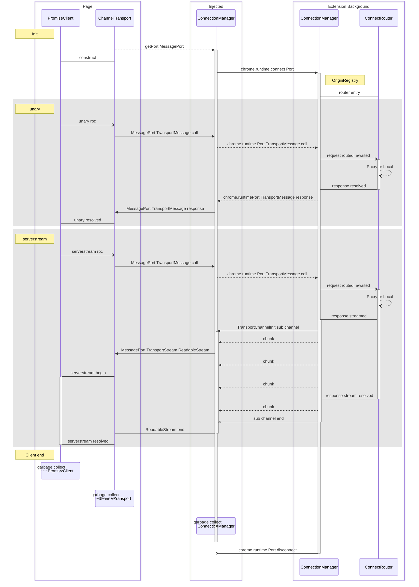

## Service Implementation

Services in this repository should eventually be re-useable, but you can also
implement your own services. Implementation is much like developing a web
service, using the normal ConnectRPC server-side metaphors and types.

This means your implementation should target the `ServiceImpl<ServiceType>` of a
`ServiceType` imported from a `connectrpc_es` package from the buf registry.

Full documentation is [available from
connectrpc](https://connectrpc.com/docs/node/implementing-services) but a brief
synopsis is provided here.

### Custody type example

An implementation of our CustodyService, which only has three endpoints,
would specify a type like:

- `ServiceImpl<typeof CustodyService>` for a complete implementation
- `Omit<ServiceImpl<typeof CustodyService>, 'exportFullViewingKey' | 'confirmAddress'>` for an implementation that omits two endpoints
- `Pick<ServiceImpl<typeof CustodyService>, 'authorize'>` for an implementation that only includes one endpoint

Targeting the full type, or a few selected methods, will provide type checking
of your implementation.

Providing your implementation to `ConnectRouter` creates a type-safe router into
your service. The `ConnectRouter` accepts a `Partial<ServiceImpl<ServiceType>>`,
but using this type for your implementation is not recommended, as it
provides no type safety.

You may alternatively type individual methods with `MethodImpl<MethodInfo>`
where `MethodInfo` is any member of `ServiceType.methods`.

The `HandlerContext` parameter on each method is not required to be implemented,
but unless your method is a pure function, you will need context. Context can be
injected by `adapter` from `@penumbra-zone/transport-dom`.

See connectrpc's [helper types
documentation](https://connectrpc.com/docs/node/implementing-services#helper-types)
for more information.

<!--
TODO: link to implementation in the codebase
-->

## Message flow

Message flow between the extension and the webapp looks like this:

<!--
TODO: review for necessary updates?
-->

