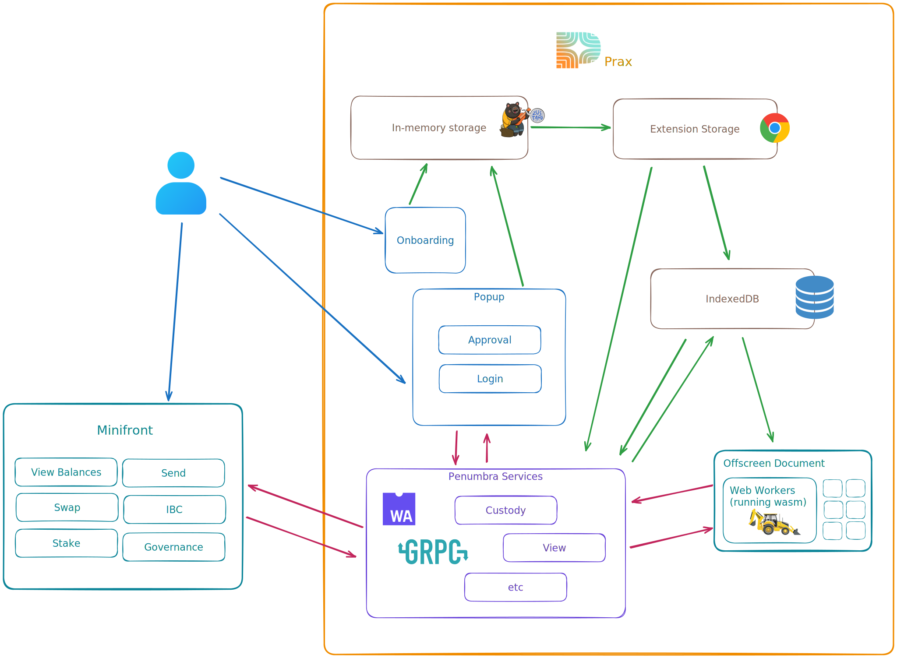

# Docs

## First read [Getting Started](../README.md#getting-started)

These handy scripts may be executed directly in an app or package directory, in
which case they only execute that package's script, or in the top level of the
repo, in which case they use turbo or the monorepo configuration.

- `pnpm clean`: remove build outputs.
- `pnpm compile`: compile rust into wasm.
- `pnpm build`: transform and bundle all packages and apps.
- `pnpm dev`: build all, serve local apps. watch and rebuild continuously.
- `pnpm test`: run vitest only. cargo tests are omitted.
- `pnpm test:rust`: run cargo tests only.
- `pnpm format`, `pnpm lint`
- `pnpm all-check`: check all!

## Subject documents

- [Guiding principles](guiding-principles.md)
  - [All code should be typesafe](guiding-principles.md#all-code-should-be-typesafe)
  - [CI/CD enforces best practices](guiding-principles.md#cicd-enforces-best-practices)
  - [Modularity from the beginning](guiding-principles.md#modularity-from-the-beginning)
  - [Ongoingly document](guiding-principles.md#ongoingly-document)
- [CI/CD guide](ci-cd.md)
- [Documenting Changes](documenting-changes.md)
- [Dependency Upgrades](dependency-upgrades.md)
- [Publishing](publishing.md)
- [State management](state-management.md)
- [UI library](ui-library.md)
- [Testing](testing.md)
- [Custody](custody.md)
- [Web Workers](web-workers.md)
- [Protobufs](protobufs.md)
- [Extension services](extension-services.md)
- [Writing performant React components](writing-performant-react-components.md)
- [Deployment](deployment.md)
- [Debugging](debugging.md)

## Tools used

- **pnpm**: a package manger
  - pnpm's workspace feature is the foundation of the monorepo
- **turborepo**: a monorepo scripting tool
  - parallelize script execution
  - manage execution dependency
  - cache outputs to accelerate execution
- **syncpack**: a monorepo dependency manager
  - synchronize package dependencies
  - validate dependency version ranges with configurable rules
  - format and lint package json
- **changeset**: a monorepo version manager
  - increment semver in a topological way
  - progressively compile release notes as PRs merge
- **vite**: a bundler/dev server
  - vite bundles monorepo apps for deployment
  - vite's lib mode also builds and bundles some packages
- **vitest**: a testing framework
  - vitest is workspace-aware
  - testing and bundling can use the same vite config
  - vitest provides in-browser testing via playwright

## The Basics

### Local, compact chain state

Minifront is a webapp blob which stores no state, and executes locally on the
user's browser. Prax is a browser extension on the user's local machine, where
it [manages keys](./custody.md), configuration, and [an abbreviated chain
representing only the user's
activity](https://www.youtube.com/watch?v=mHoe7lQMcxU).

### Simplified architecture

Minifront (and eventually other dapps) [connect to
services](./extension-services.md) hosted by Prax (and eventually other
providers) for information on the user's chain state, and to conduct new
activity.

Prax queries a remote 'full node' `pd` endpoint to scan the compact chain,
download full block details when interested, and broadcast new chain activity.
Omitting the remote endpoint, it looks something like this:

<!-- This link is read-only. Update if you edit or replace the diagram.
https://excalidraw.com/#json=_3b4K0RpWFJWAtVCH5ymB,CHegLkto1X_NdKG67LNh2A
-->

### Some critical details

Prax and Minifront [share React components](./ui-library.md) and some other
reuseable dependencies.

Both Prax and Minifront manage running state with Zustand. For storage, Prax
uses extension storage and idb. Minifront does not store anything.

Prax [parallelizes WASM during transaction
builds](https://penumbra.zone/blog/faster-client-side-proving-with-parallelism)
by launching individual [web workers](./web-workers.md) for each chunk of work.
Chrome extension workers can't launch web workers, so this is managed via the
'Offscreen' feature of the chrome extension API which provides full DOM
compatibility.

WASM directly accesses IDB for some operations, outside of the typical
interface.
