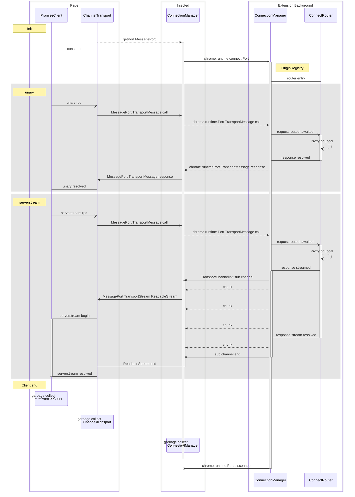

# Extension Services

The browser extension uses a custom transport for `@connectrpc/connect` to
provide Protobuf-specified services via a DOM `MessagePort`. This provides many
benefits including auto-generated clients and server stubs.

You may use locally generated service types or simply install the [appropriate
packages from the buf
registry](https://buf.build/penumbra-zone/penumbra/sdks/main) for whatever
language you're working in.

Bufbuild provides documentation explaining the buf registry; if you are using
npm their [npm-specific guide](https://buf.build/docs/bsr/generated-sdks/npm) is
recommended reading.

## Third-party connection

The custom transport is available in `@penumbra-zone/transport`. The transport
is generic for any `ServiceType`, and not Penumbra-specific. Each transport should
be used only for one client at a time.

<!--
TODO: transport could imminently support multiple clients
-->

For successful init of a channel transport, you must provide a function to
acquire a private `MessagePort`. The Penumbra extension creates a global at
`window.penumbra` containing access to our service connection manager. You could
provide something like this to the transport:

```javascript
function getPenumbraPort(service: string): MessagePort {
  const serviceInitPort = window.penumbra.services[service];
  if (!serviceInitPort) throw Error(`No init port for service ${service}`);
  const { port1, port2 } = new MessageChannel();
  serviceInitPort.postMessage(
    { type: 'INIT_CHANNEL_CLIENT', port: port2, service },
    [port2],
  );
  return port1;
}
```

And pass it in like this:

```javascript
import { createPromiseClient } from '@connectrpc/connect';
import { createChannelTransport } from '@penumbra-zone/transport';
import { ViewProtocolService } from '@buf/penumbra-zone_penumbra.connectrpc_es/penumbra/view/v1alpha1/view_connect';

const viewClient = createPromiseClient(
  ViewProtocolService,
  createChannelTransport(ViewProtocolService, getPenumbraPort),
);
```

Creation is fully synchronous and the client is immediately useable.

If you are writing a React or other Tanstack app, it should be possible to use
connectrpc's Query tooling, for Unary requests at least. Check out the docs for
`TransportProvider` and `useTransport` in [the connect-query
readme](https://github.com/connectrpc/connect-query-es/blob/49308a24ea15568828e50d91dd1c8bf808555983/README.md#transportprovider).

## Service Implementation

Services can be implemented using the normal connectrpc server metaphors and
types. This means you can target the `ServiceImpl<ServiceType>` of a
`ServiceType` imported from a `connectrpc_es` package from the buf registry.
Full documentation is [available from
connectrpc](https://connectrpc.com/docs/node/implementing-services) but a brief
synopsis is provided here.

## for example

An implementation of our CustodyProtocolService, which only has three endpoints,
could specify a type like:

- `ServiceImpl<typeof CustodyProtocolService>`
- `Omit<ServiceImpl<typeof CustodyProtocolService>, 'exportFullViewingKey' | 'confirmAddress'>`
- `Pick<ServiceImpl<typeof CustodyProtocolService>, 'authorize'>`

Targeting the full type, or a few selected methods, will provide type checking
of your implementation, and providing the impl to a `ConnectRouter` creates a
type-safe router into your service. The `ConnectRouter` accepts a
`Partial<ServiceImpl<ServiceType>>` but targeting this type in your
implementation is not recommended, as it provides no type safety.

You may also individually implement methods by targeting
`MethodImpl<MethodInfo>` where `MethodInfo` is any member of
`ServiceType.methods`. The `HandlerContext` parameter is not required to be
implemented, but you may choose to require it in any particular method
implementation.

See connectrpc's [helper types
documentation](https://connectrpc.com/docs/node/implementing-services#helper-types)
for more information.

<!--
TODO: link to implementation in the codebase
-->

## Message flow

Message flow between the extension and the webapp looks like this:

<!--
TODO: review for necessary updates?
-->


