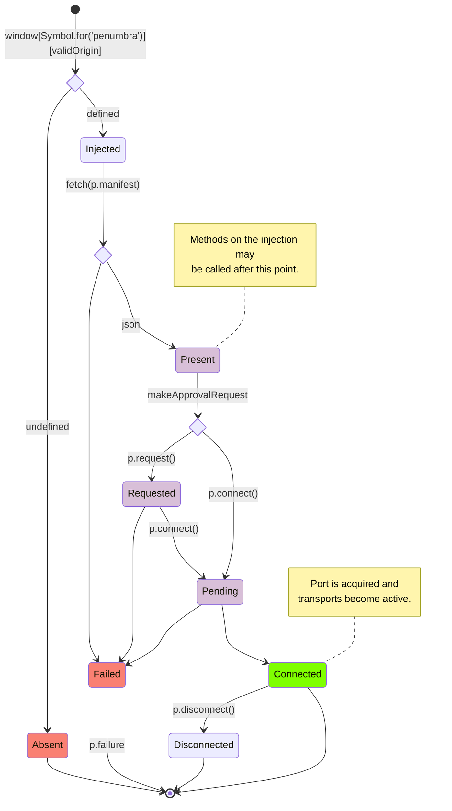

# `@penumbra-zone/react`

This package contains a React context provider and some simple hooks for using
the page API described in `@penumbra-zone/client`. You might want to use this if
you're writing a Penumbra dapp in React.

**To use this package, you need to [enable the Buf Schema Registry](https://buf.build/docs/bsr/generated-sdks/npm):**

```sh
npm config set @buf:registry https://buf.build/gen/npm/v1
```

## Overview

You must independently identify a Penumbra extension to which your app wishes to
connect.

Then, use of `<PenumbraProvider>` with an `origin` prop identifying your
preferred extension, or `injection` prop identifying the actual page injection
from your preferred extension, will result in automatic progress towards a
successful connection.

Hooks `usePenumbraTransport` and `usePenumbraService` will unconditionally
provide a transport or client to the Penumbra extension that queues requests
while connection is pending, and begins returning responses when appropriate.

## `<PenumbraProvider>`

This wrapping component will provide a context available to all child components
that is directly accessible by `usePenumbra`, or additionally by
`usePenumbraTransport` or `usePenumbraService`.

### Unary requests may use `@connectrpc/connect-query`

If you'd like to use `@connectrpc/connect-query`, you may call
`usePenumbraTransport` to satisfy `<TransportProvider>`.

Be aware that connect query only supports unary requests at the moment (no
streaming).

A wrapping component:

```tsx
import { Outlet } from 'react-router-dom';
import { PenumbraProvider } from '@penumbra-zone/react';
import { usePenumbraTransport } from '@penumbra-zone/react/hooks/use-penumbra-transport';
import { TransportProvider } from '@connectrpc/connect-query';
import { QueryClient, QueryClientProvider } from '@tanstack/react-query';

const praxOrigin = 'chrome-extension://lkpmkhpnhknhmibgnmmhdhgdilepfghe';
const queryClient = new QueryClient();

export const PenumbraDappPage = () => (
  <PenumbraProvider origin={praxOrigin} makeApprovalRequest>
    <TransportProvider transport={usePenumbraTransport()}>
      <QueryClientProvider client={queryClient}>
        <Outlet />
      </QueryClientProvider>
    </TransportProvider>
  </PenumbraProvider>
);
```

A querying component:

```tsx
import { addressByIndex } from '@buf/penumbra-zone_penumbra.connectrpc_query-es/penumbra/view/v1/view-ViewService_connectquery';
import { useQuery } from '@connectrpc/connect-query';
import { bech32mAddress } from '@penumbra-zone/bech32m/penumbra';

export const PraxAddress = ({ account }: { account?: number }) => {
  const { data } = useQuery(addressByIndex, { addressIndex: { account } });
  return data?.address && bech32mAddress(data.address);
};
```

### Streaming requests must directly use a `PromiseClient`

If you'd like to make streaming queries, or you just want to manage queries
yourself, you can call `usePenumbraService` with the `ServiceType` you're
interested in to acquire a `PromiseClient` of that service. A simplistic example
is below.

Some streaming queries may return large amounts of data, or stream updates
continuosuly until aborted. For a good user experience with those queries, you
may need more complex query and state management.

```tsx
import { AssetId } from '@buf/penumbra-zone_penumbra.bufbuild_es/penumbra/core/asset/v1/asset_pb.js';
import { BalancesResponse } from '@buf/penumbra-zone_penumbra.bufbuild_es/penumbra/view/v1/view_pb.js';
import { usePenumbraService } from '@penumbra-zone/react/hooks/use-penumbra-service';
import { ViewService } from '@penumbra-zone/protobuf';
import { useQuery } from '@tanstack/react-query';
import { AccountBalancesTable } from './imaginary-components';

export default function AssetBalancesByAccount({ assetIdFilter }: { assetIdFilter: AssetId }) {
  const viewClient = usePenumbraService(ViewService);

  const { isPending, data: groupedBalances } = useQuery({
    queryKey: ['balances', assetIdFilter.inner],

    queryFn: ({ signal }): Promise<BalancesResponse[]> =>
      // wait for stream to collect
      Array.fromAsync(viewClient.balances({ assetIdFilter }, { signal })),

    select: (data: BalancesResponse[]) =>
      Map.groupBy(
        // filter undefined
        data.filter(({ balanceView, accountAddress }) => accountAddress?.addressView?.value),
        // group by account
        ({ accountAddress }) => accountAddress.addressView.value.index,
      ),
  });

  if (isPending) return <LoadingSpinner />;
  if (groupedBalances)
    return Array.from(groupedBalances.entries()).map(([accountIndex, balanceResponses]) => (
      <AccountBalancesTable key={accountIndex} asset={assetIdFilter} balances={balanceResponses} />
    ));
}
```

## Possible provider states

On the bare Penumbra injection, there is only a boolean/undefined
`isConnected()` state and a few simple actions available. It is generally robust
and should asynchronously progress towards an active connection if possible,
even if steps are performed 'out-of-order'.

This package's exported `<PenumbraProvider>` component handles this state and
all of these transitions for you. Use of `<PenumbraProvider>` with an `origin`
or `injection` prop will result in automatic progress towards a `Connected`
state.

During this progress, the context exposes an explicit status, so you may easily
condition your layout and display. You can access this status via
`usePenumbra().state`. All possible values are represented by the exported enum
`PenumbraProviderState`.

Hooks `usePenumbraTransport` and `usePenumbraService` conceal this state, and
unconditionally provide a transport or client.

`Connected` is the only state in which a `MessagePort`, working `Transport`, or
working client is available.

### State chart

This flowchart reads from top (page load) to bottom (page unload). Each labelled
chart node is a possible value of `PenumbraProviderState`. Diamond-shaped nodes
are conditions described by the surrounding path labels.

There are more possible transitions than diagrammed here - for instance once
methods are exposed, a `disconnect()` call will always transition directly into
a `Disconnected` state. A developer not using this wrapper, calling methods
directly, may enjoy failures at any moment. This diagram only represents a
typical state flow.

The far right side path is the "happy path".


